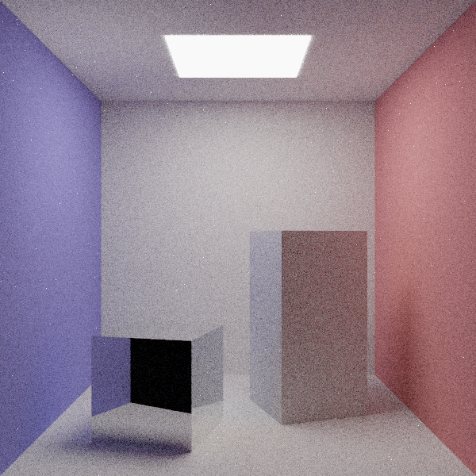

# Системы компьютерной обработки изображений - Лабораторная работа № 5

## Информация

Системы компьютерной обработки изображений

Лабораторная работа № 5

«Формирование изображения методом трассировки путей»

**Выполнили студенты:**
Билошицкий Михаил Владимирович, P3416
Шпинёва Ульяна Сергеевна, P3416
Хоробрых Даниил Евгеньевич, P3416
Нестеренко Ксения Максимовна, P3416

Группа № P3416

Преподаватель: Жданов Дмитрий Дмитриевич

Ссылка на репозиторий: [GitHub](https://github.com/michael-bill/images-labs-itmo/tree/main/lab5)

Санкт-Петербург, 2025

---

## 1. Цель работы

Освоить методы синтеза изображений трёхмерных сцен с глобальным освещением методом трассировки путей (Path Tracing).

## 2. Задание

Построить изображение сцены Cornell Box с корректным глобальным освещением.

Требования:
- Геометрия — треугольная сетка
- Материалы — диффузное (Ламберт) и зеркальное отражение
- Выборка по значимости для выбора типа отражения
- Русская рулетка для ограничения глубины
- NEE для прямого освещения
- Точечная камера с антиалиасингом
- Тонемаппинг и гамма-коррекция ($\gamma = 2.2$)
- Сохранение в PPM

## 3. Структура проекта

```
lab5/
├── main.py              — точка входа, конфигурация параметров
├── src/
│   ├── renderer.py      — основной цикл рендеринга, trace_path()
│   ├── scene.py         — класс Scene, intersect_scene(), sample_light_point()
│   ├── geometry.py      — ray_triangle_intersect(), вычисление нормалей
│   ├── camera.py        — класс Camera, get_ray()
│   ├── cornell_box.py   — создание сцены Cornell Box
│   ├── math_utils.py    — dot(), cross(), reflect(), random_cosine_hemisphere()
│   └── postprocess.py   — тонемаппинг, гамма-коррекция, сохранение
├── output/
│   ├── result.png
│   └── result.ppm
└── docs/
    └── task.md          — исходное задание
```

## 4. Описание алгоритма

### 4.1. Уравнение рендеринга

В основе path tracing лежит уравнение рендеринга Каджии:

$$L_o(x, \omega_o) = L_e(x, \omega_o) + \int_{\Omega} f_r(x, \omega_i, \omega_o) \cdot L_i(x, \omega_i) \cdot (\omega_i \cdot n) \, d\omega_i$$

- $L_o$ — исходящая яркость из точки $x$ в направлении $\omega_o$
- $L_e$ — собственное излучение (для источников света)
- $f_r$ — BRDF материала
- $L_i$ — входящая яркость
- $(\omega_i \cdot n)$ — косинус угла падения

Интеграл вычисляется методом Монте-Карло — усредняем по случайным направлениям:

$$L_o \approx \frac{1}{N} \sum_{j=1}^{N} \frac{f_r \cdot L_i \cdot (\omega_j \cdot n)}{p(\omega_j)}$$

**Реализация:** `src/renderer.py`, функция `render_image()` — цикл по пикселям и сэмплам:

```python
# src/renderer.py: render_image()
for y in prange(height):
    for x in range(width):
        pixel_color = np.zeros(3)
        
        for _ in range(samples_per_pixel):
            origin, direction = get_ray(x, y, ...)  # из src/camera.py
            sample_color = trace_path(origin, direction, ...)
            pixel_color = pixel_color + sample_color
        
        image[y, x] = pixel_color / samples_per_pixel
```

### 4.2. Генерация лучей камеры

**Файл:** `src/camera.py`

Класс `Camera` хранит позицию, направление и параметры FOV. Функция `get_ray()` генерирует луч для пикселя с jitter для антиалиасинга:

```python
# src/camera.py: get_ray()
def get_ray(x, y, width, height, position, forward, right, up, 
            half_width, half_height, jitter=True):
    # случайное смещение внутри пикселя
    if jitter:
        px = x + random()
        py = y + random()
    else:
        px = x + 0.5
        py = y + 0.5
    
    # нормализованные координаты [-1, 1]
    u = (2.0 * px / width - 1.0) * half_width
    v = (1.0 - 2.0 * py / height) * half_height
    
    direction = normalize(forward + right * u + up * v)
    return position.copy(), direction
```

### 4.3. Пересечение луча с треугольником

**Файл:** `src/geometry.py`

Используется алгоритм Мёллера-Трумбора. Луч: $R(t) = O + tD$. Точка на треугольнике $(V_0, V_1, V_2)$:

$$P = (1 - u - v)V_0 + uV_1 + vV_2$$

Решение системы:

$$\begin{bmatrix} t \\ u \\ v \end{bmatrix} = \frac{1}{(D \times E_2) \cdot E_1} \begin{bmatrix} (T \times E_1) \cdot E_2 \\ (D \times E_2) \cdot T \\ (T \times E_1) \cdot D \end{bmatrix}$$

где $E_1 = V_1 - V_0$, $E_2 = V_2 - V_0$, $T = O - V_0$.

Пересечение валидно если $t > 0$, $u \geq 0$, $v \geq 0$, $u + v \leq 1$.

```python
# src/geometry.py: ray_triangle_intersect()
def ray_triangle_intersect(ray_origin, ray_dir, v0, v1, v2):
    EPSILON = 1e-7
    edge1 = v1 - v0                     # E1
    edge2 = v2 - v0                     # E2
    
    h = cross(ray_dir, edge2)           # D × E2
    a = dot(edge1, h)                   # (D × E2) · E1
    if abs(a) < EPSILON: return -1.0    # луч параллелен плоскости
    
    f = 1.0 / a
    s = ray_origin - v0                 # T
    u = f * dot(s, h)
    if u < 0.0 or u > 1.0: return -1.0
    
    q = cross(s, edge1)                 # T × E1
    v = f * dot(ray_dir, q)
    if v < 0.0 or u + v > 1.0: return -1.0
    
    t = f * dot(edge2, q)
    if t < EPSILON: return -1.0
    
    return t
```

### 4.4. Поиск пересечения со сценой

**Файл:** `src/scene.py`

Функция `intersect_scene()` перебирает все треугольники и находит ближайшее пересечение:

```python
# src/scene.py: intersect_scene()
def intersect_scene(ray_origin, ray_dir, vertices, normals, material_ids):
    closest_t = np.inf
    hit_idx = -1
    
    for i in range(vertices.shape[0]):
        t = ray_triangle_intersect(
            ray_origin, ray_dir,
            vertices[i, 0], vertices[i, 1], vertices[i, 2]
        )
        if t > 0 and t < closest_t:
            closest_t = t
            hit_idx = i
    
    if hit_idx < 0:
        return -1.0, np.zeros(3), np.zeros(3), -1
    
    hit_point = ray_origin + ray_dir * closest_t
    normal = normals[hit_idx]
    
    # ориентируем нормаль к источнику луча
    if dot(normal, ray_dir) > 0:
        normal = -normal
    
    return closest_t, hit_point, normal, material_ids[hit_idx]
```

### 4.5. Материалы и BRDF

**Файлы:** `src/scene.py` (хранение), `src/renderer.py` (использование), `src/math_utils.py` (reflect)

**Диффузное отражение (Ламберт):**

$$f_r^{diffuse} = \frac{\rho_d}{\pi}$$

где $\rho_d$ — альбедо. Деление на $\pi$ нормализует BRDF.

**Зеркальное отражение:**

$$\omega_r = \omega_i - 2(\omega_i \cdot n) \cdot n$$

```python
# src/math_utils.py: reflect()
def reflect(direction, normal):
    return direction - normal * (2.0 * dot(direction, normal))
```

Выбор типа отражения — importance sampling по весам материала:

```python
# src/renderer.py: trace_path(), строки 66-74
diff_weight = max(mat_diffuse[0], mat_diffuse[1], mat_diffuse[2])
spec_weight = max(mat_specular[0], mat_specular[1], mat_specular[2])
total_weight = diff_weight + spec_weight

p_diffuse = diff_weight / total_weight

if random() < p_diffuse:
    # диффузное
    new_dir = random_cosine_hemisphere(normal)
    throughput = throughput * mat_diffuse
else:
    # зеркальное
    new_dir = reflect(current_dir, normal)
    throughput = throughput * mat_specular
```

### 4.6. Косинус-взвешенная выборка направлений

**Файл:** `src/math_utils.py`

Для диффузных поверхностей сэмплируем с учётом косинуса — направления ближе к нормали важнее.

Плотность: $p(\omega) = \frac{\cos\theta}{\pi}$

Генерация ($\xi_1, \xi_2 \in [0,1]$):

$$\phi = 2\pi \xi_1, \quad \cos\theta = \sqrt{\xi_2}, \quad \sin\theta = \sqrt{1 - \xi_2}$$

```python
# src/math_utils.py: random_cosine_hemisphere()
def random_cosine_hemisphere(normal):
    r1 = random()
    r2 = random()
    
    phi = 2.0 * np.pi * r1
    cos_theta = np.sqrt(r2)
    sin_theta = np.sqrt(1.0 - r2)
    
    # локальные координаты
    x = np.cos(phi) * sin_theta
    y = np.sin(phi) * sin_theta
    z = cos_theta
    
    # строим базис от нормали
    if abs(normal[0]) > 0.9:
        up = np.array([0.0, 1.0, 0.0])
    else:
        up = np.array([1.0, 0.0, 0.0])
    
    tangent = normalize(cross(up, normal))
    bitangent = cross(normal, tangent)
    
    return normalize(tangent * x + bitangent * y + normal * z)
```

### 4.7. Русская рулетка

**Файл:** `src/renderer.py`, строки 57-64

После глубины `rr_depth` путь может оборваться случайно. Вероятность продолжения:

$$p_{continue} = \min(\max(\rho_d + \rho_s), 0.95)$$

Для несмещённости корректируем вес:

$$throughput = \frac{throughput}{p_{continue}}$$

```python
# src/renderer.py: trace_path()
total_refl = mat_diffuse + mat_specular
p_continue = min(max(total_refl[0], total_refl[1], total_refl[2]), 0.95)

if depth >= rr_depth:
    if random() > p_continue:
        break  # обрываем путь
    throughput = throughput / p_continue  # компенсируем
```

### 4.8. Next Event Estimation (NEE)

**Файлы:** `src/scene.py` (`sample_light_point()`), `src/renderer.py` (использование)

Явно сэмплируем источник света для уменьшения шума. Выбираем случайную точку $y$ на источнике:

$$L_{direct} = L_e(y) \cdot \frac{\rho_d}{\pi} \cdot G(x, y) \cdot A_{light}$$

Геометрический фактор:

$$G(x, y) = \frac{(\omega \cdot n_x) \cdot (-\omega \cdot n_y)}{|x - y|^2}$$

```python
# src/scene.py: sample_light_point()
def sample_light_point(vertices, normals, emission, material_ids,
                       light_indices, light_areas, total_light_area):
    # выбираем источник пропорционально площади
    r = random() * total_light_area
    cumsum = 0.0
    for i in range(len(light_indices)):
        cumsum += light_areas[i]
        if r <= cumsum:
            light_idx = i
            break
    
    tri_idx = light_indices[light_idx]
    point = sample_triangle_point(vertices[tri_idx, 0], ...)
    normal = normals[tri_idx]
    emiss = emission[material_ids[tri_idx]]
    
    return point, normal, emiss, 1.0 / light_areas[light_idx]
```

```python
# src/renderer.py: trace_path(), расчёт прямого освещения
light_point, light_normal, light_emission, pdf = sample_light_point(...)

to_light = light_point - hit_point
dist = length(to_light)
light_dir = to_light / dist

cos_theta = dot(normal, light_dir)
cos_theta_light = dot(-light_dir, light_normal)

if cos_theta > 0 and cos_theta_light > 0:
    # shadow ray
    shadow_t, _, _, _ = intersect_scene(hit_point + offset, light_dir, ...)
    
    if shadow_t < 0 or shadow_t > dist - 0.001:
        geometry = cos_theta * cos_theta_light / (dist * dist)
        brdf = mat_diffuse / np.pi
        direct = light_emission * brdf * geometry * total_light_area
        color = color + throughput * direct
```

### 4.9. Постобработка

**Файл:** `src/postprocess.py`

HDR → LDR преобразование.

**Тонемаппинг Рейнхарда:**
$$L_{out} = \frac{L_{in}}{1 + L_{in}}$$

**Гамма-коррекция:**
$$V_{out} = V_{in}^{1/\gamma}, \quad \gamma = 2.2$$

```python
# src/postprocess.py: tonemap_and_gamma()
def tonemap_and_gamma(image, gamma=2.2, exposure=1.5):
    image = image * exposure
    image = image / (1.0 + image)       # Reinhard
    image = np.clip(image, 0, 1)
    image = np.power(image, 1.0 / gamma)
    return image
```

**Сохранение в PPM:**

```python
# src/postprocess.py: save_ppm()
def save_ppm(filename, image):
    height, width = image.shape[:2]
    image_8bit = (image * 255).astype(np.uint8)
    
    with open(filename, 'w') as f:
        f.write(f"P3\n{width} {height}\n255\n")
        for y in range(height):
            row = []
            for x in range(width):
                r, g, b = image_8bit[y, x]
                row.append(f"{r} {g} {b}")
            f.write(" ".join(row) + "\n")
```

### 4.10. Создание сцены Cornell Box

**Файл:** `src/cornell_box.py`

Функция `create_cornell_box()` создаёт сцену из параметров конфига:

- 5 стен (пол, потолок, задняя, левая красная, правая синяя)
- Источник света на потолке
- Два куба (диффузный и зеркальный)

```python
# src/cornell_box.py: create_cornell_box()
def create_cornell_box(config):
    scene = Scene()
    
    # материалы
    mat_white = scene.add_material(diffuse=white)
    mat_red = scene.add_material(diffuse=left_color)
    mat_blue = scene.add_material(diffuse=right_color)
    mat_light = scene.add_material(emission=[...])
    
    # стены (квады = 2 треугольника)
    scene.add_quad([...], mat_white)  # пол
    scene.add_quad([...], mat_white)  # потолок
    scene.add_quad([...], mat_red)    # левая
    scene.add_quad([...], mat_blue)   # правая
    
    # источник света
    scene.add_quad([...], mat_light)
    
    # кубы
    add_box(scene, box1_pos, ..., mat_diffuse_box)
    add_box(scene, box2_pos, ..., mat_mirror_box)
    
    scene.compile()  # собираем numpy массивы
    return scene
```

## 5. Параметры

**Файл:** `main.py`, словарь `CONFIG`

Все параметры рендеринга задаются в конфигурационном словаре:

### 5.1. Параметры рендеринга

- `width`: 600 — ширина выходного изображения в пикселях
- `height`: 600 — высота выходного изображения в пикселях
- `samples_per_pixel`: 512 — количество сэмплов (лучей) на пиксель; большее значение уменьшает шум, но увеличивает время рендеринга
- `max_depth`: 6 — максимальная глубина трассировки луча (количество отскоков)
- `russian_roulette_depth`: 2 — глубина, после которой начинает работать русская рулетка для вероятностного обрыва пути

### 5.2. Параметры камеры

- `camera_position`: [0, 2.5, -8] — позиция камеры в мировых координатах (x, y, z)
- `camera_look_at`: [0, 2.5, 0] — точка, на которую направлена камера
- `camera_fov`: 45 — поле зрения (Field of View) в градусах

### 5.3. Параметры сцены (Cornell Box)

- `room_size`: 5.0 — размер комнаты (расстояние от центра до стены)
- `left_wall_color`: [0.75, 0.25, 0.25] — цвет левой стены (красный) в RGB [0..1]
- `right_wall_color`: [0.25, 0.25, 0.75] — цвет правой стены (синий) в RGB [0..1]
- `wall_color`: [0.75, 0.75, 0.75] — цвет остальных стен (белый) в RGB [0..1]

### 5.4. Параметры источника света

- `light_intensity`: 15.0 — интенсивность излучения источника света
- `light_color`: [1.0, 0.95, 0.9] — цвет света (тёплый белый) в RGB [0..1]
- `light_size`: 1.8 — размер квадратного источника света на потолке

### 5.5. Параметры левого куба (диффузный)

- `box1_position`: [-1.0, 0, 0.5] — позиция куба (x, y, z)
- `box1_size`: 1.3 — размер куба
- `box1_rotation`: -18 — угол поворота вокруг оси Y в градусах
- `box1_diffuse`: [0.75, 0.75, 0.75] — диффузный цвет (светло-серый)
- `box1_specular`: [0.0, 0.0, 0.0] — коэффициент зеркальности (без зеркального отражения)

### 5.6. Параметры правого куба (зеркальный)

- `box2_position`: [1.0, 0, -0.5] — позиция куба (x, y, z)
- `box2_size`: 1.3 — размер куба
- `box2_rotation`: 15 — угол поворота вокруг оси Y в градусах
- `box2_diffuse`: [0.05, 0.05, 0.05] — диффузный цвет (почти чёрный)
- `box2_specular`: [0.9, 0.9, 0.9] — коэффициент зеркальности (высокая отражательная способность)

### 5.7. Параметры постобработки

- `gamma`: 2.2 — значение для гамма-коррекции (стандартное значение для sRGB)
- `exposure`: 1.5 — экспозиция для тонемаппинга (регулирует общую яркость)

```python
CONFIG = {
    # Параметры рендеринга
    'width': 600,
    'height': 600,
    'samples_per_pixel': 512,
    'max_depth': 6,
    'russian_roulette_depth': 2,

    # Камера
    'camera_position': [0, 2.5, -8],
    'camera_look_at': [0, 2.5, 0],
    'camera_fov': 45,

    # Сцена (Cornell Box)
    'room_size': 5.0,
    'left_wall_color': [0.75, 0.25, 0.25],
    'right_wall_color': [0.25, 0.25, 0.75],
    'wall_color': [0.75, 0.75, 0.75],

    # Источник света
    'light_intensity': 15.0,
    'light_color': [1.0, 0.95, 0.9],
    'light_size': 1.8,

    # Левый куб (диффузный)
    'box1_position': [-1.0, 0, 0.5],
    'box1_size': 1.3,
    'box1_rotation': -18,
    'box1_diffuse': [0.75, 0.75, 0.75],
    'box1_specular': [0.0, 0.0, 0.0],

    # Правый куб (зеркальный)
    'box2_position': [1.0, 0, -0.5],
    'box2_size': 1.3,
    'box2_rotation': 15,
    'box2_diffuse': [0.05, 0.05, 0.05],
    'box2_specular': [0.9, 0.9, 0.9],

    # Постобработка
    'gamma': 2.2,
    'exposure': 1.5,
}
```

## 6. Результат



Эффекты глобального освещения:
- Color bleeding — красный и синий оттенки от стен на кубах и полу
- Мягкие тени от площадного источника
- Отражения в зеркальном кубе

## 7. Вывод

Реализован path tracer с NEE и русской рулеткой. Получено физически корректное изображение Cornell Box с глобальным освещением.
