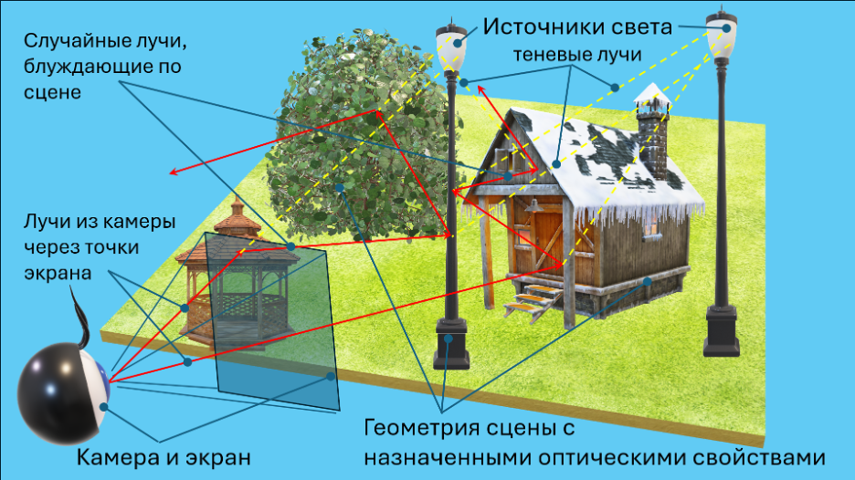

## Цель

Освоить простейшие методы синтеза изображений трехмерных сцен с учетом глобального освещения методом трассировки путей. Убедиться и доказать корректность сформированного изображения.

## Задание

Построить изображение трехмерной сцены с корректным учетом глобального освещения методом трассировки путей.

### Исходные данные и допущения

- Модель геометрии сцены формируется треугольной сеткой. Треугольная сетка может быть сформирована вручную или импортирована из OBJ файла. Для поиска точки встречи луча с поверхностью можно написать свою функцию или воспользоваться библиотекой (например, Embree).
- Цветовая модель – RGB.
- Модель оптических свойств материалов:
  - Пропускание отсутствует, среда равномерная и прозрачная с постоянным показателем преломления = 1.
  - Оптические свойства на поверхностях: коэффициент диффузного отражения (Ламберт) и коэффициент зеркального отражения (чистое зеркало). Оба свойства могут быть заданы одновременно на одной поверхности.
  - Выбирается одно событие (свойство) методами выборки по значимости и русской рулетки.
  - Коэффициенты цветные. Новое направление и цвет луча выбираются в соответствии с выбранным событием.
  - Желательно обеспечить постоянство энергии луча.
  - Обязательное условие – физичность модели (суммарное отражение для каждой компоненты цвета не превышает 1).
- Камера точечная. Разрешение: от 500×500 до 1000×1000 точек. Антиалиасинг обеспечивается случайным выбором координат точки в пределах одного пикселя.
- Источники света – протяженные, диаграмма излучения – Ламберт. Источники цветные. Расчет прямого освещения можно ограничить одним случайным лучом со случайно выбранного источника света. Использовать выборку по значимости в соответствии с мощностью источника света. Яркость по поверхности треугольника постоянна.
- Продолжительность расчета можно задать временем, точностью или числом лучей, выпущенных с каждого пикселя изображения.
- Изображение формируется в абсолютных яркостях, затем переводится в область относительных яркостей с нормировкой (на максимальную, среднюю или заданную яркость). Значения выше 1 отсекаются до 1.
  - Далее применяется гамма-коррекция: V_corr = V^(1/γ) (обычно γ = 2.2).
  - Результат приводится к диапазону 0–255 и записывается в файл изображения (простейший формат PPM).

## Результат

Результат представляется в виде отчета, содержащего:
- Описание алгоритмов и методов, используемых в программе.
- Текст программы (с комментариями).
- Файлы изображений.

Программа должна иметь достаточно простой интерфейс (любого вида) для возможности изменения параметров сцены и получения нового результата в процессе защиты работы.
